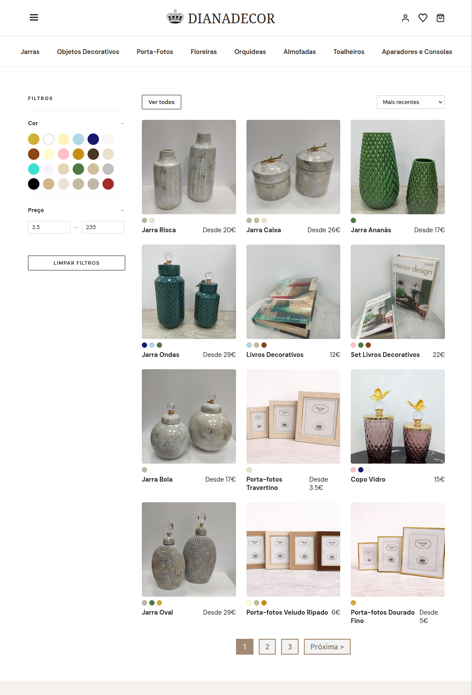
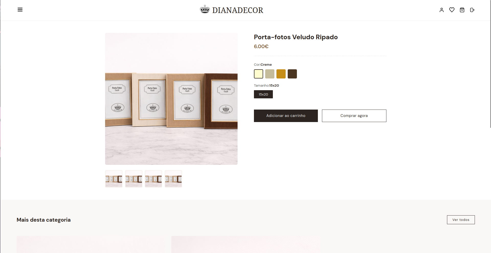
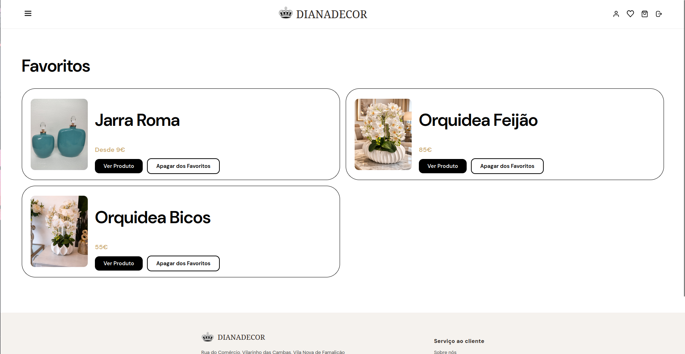
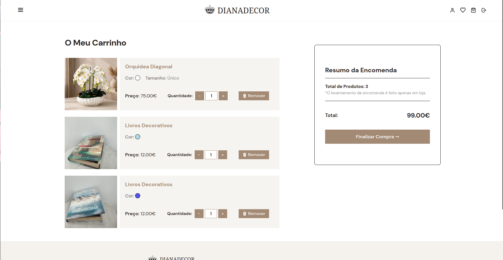
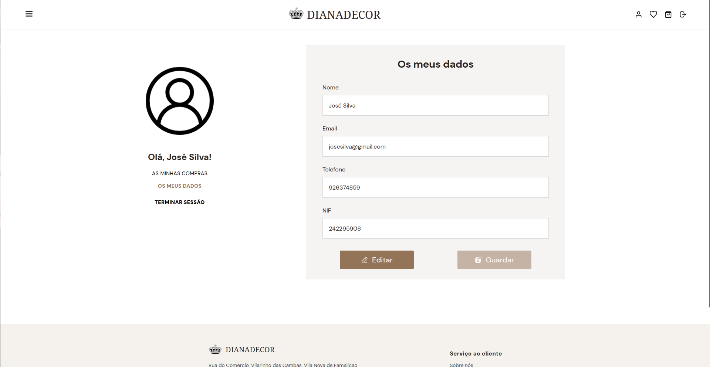
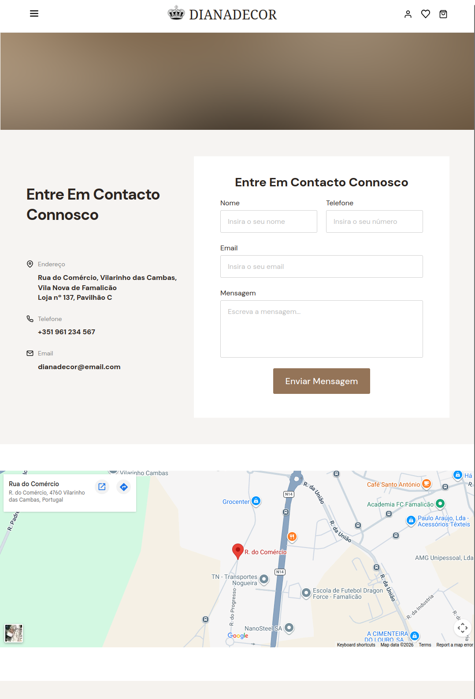
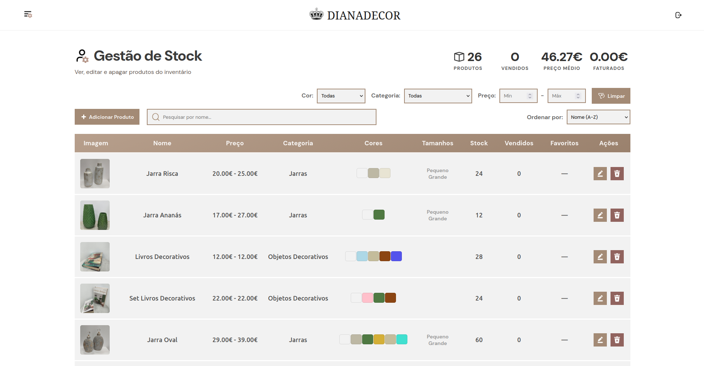
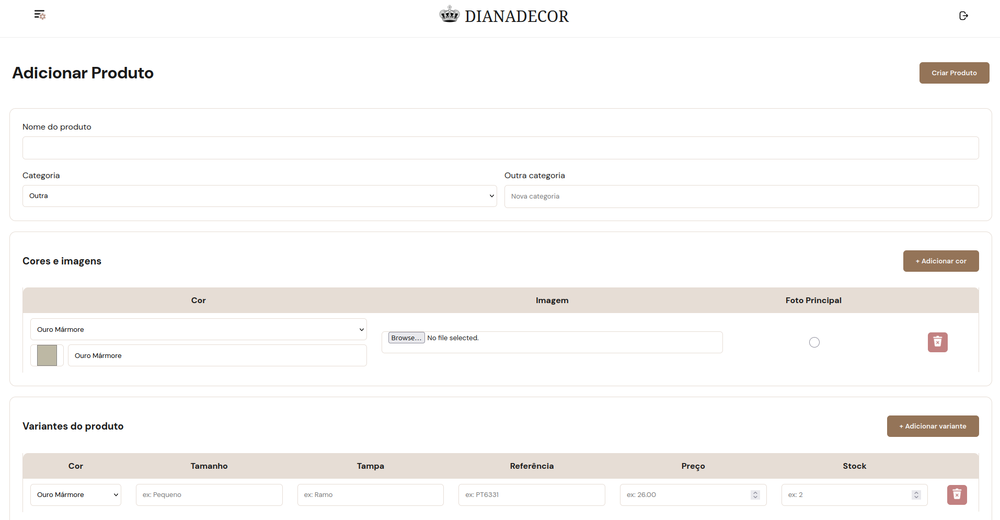
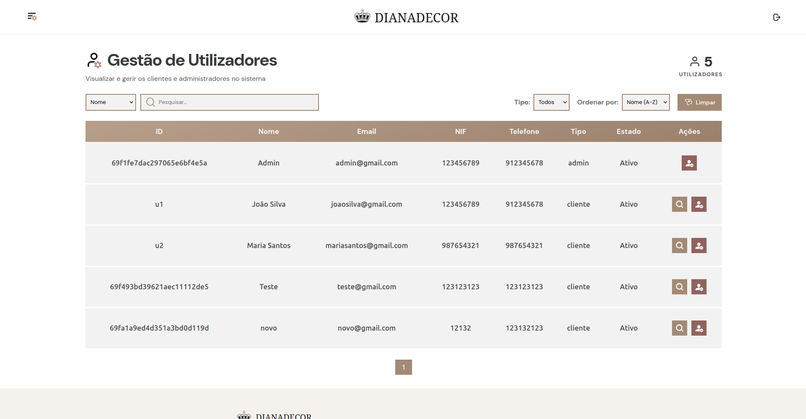
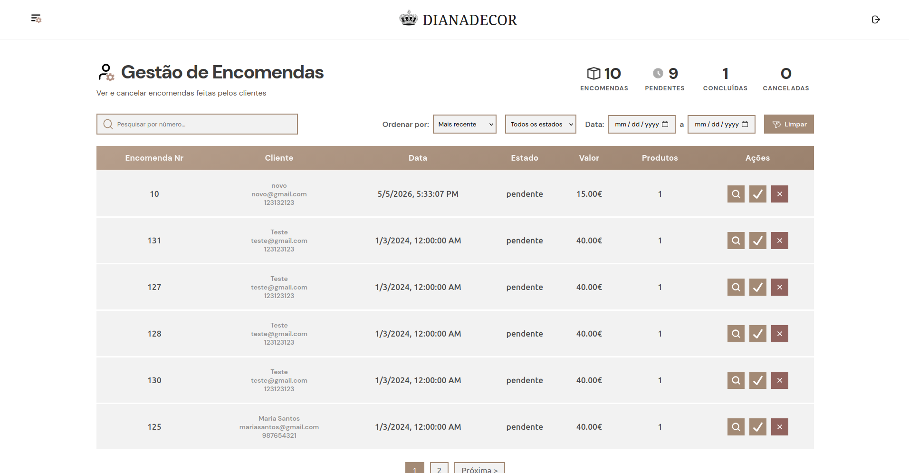

# DIANADECOR
A **Dianadecor** é uma empresa real da área da decoração que necessitava de um website com uma componente pública para clientes e uma componente administrativa para a gestão interna. Este projeto foi desenvolvido no âmbito da Unidade Curricular de Engenharia Web, no ano letivo 2025/2026.

Numa fase inicial, foi realizado o design na plataforma **Figma**, permitindo alinhar todos os elementos do grupo quanto à estrutura visual e à organização das páginas. Durante este processo houve também a preocupação de criar uma interface acessível, intuitiva e adequada aos destinatários do website.

O projeto integra uma arquitetura baseada em serviços, recorrendo a APIs para separar responsabilidades entre a interface, a autenticação e a gestão de dados. 
Assim, o projeto procura responder aos requisitos definidos para a Unidade Curricular, combinando uma componente prática de desenvolvimento web com uma aplicação útil para um cenário real.

## Base de dados

A base de dados foi implementada através de um c
Os dados inicialmente fornecidos pela empresa incluíam as imagens dos produtos e um ficheiro CSV com o nome, preço e stock de cada produto. A partir destes dados e das funcionalidades que seriam necessárias implementar, foi definida uma estrutura para a base de dados constituída pelas seguintes coleções:

- **Produtos**
- **Users** (utilizadores)
- **Categorias** (dos produtos)
- **Cores** (dos produtos)
- **Encomendas** (dos clientes)
- **Carrinhos** (carrinho de compras dos clientes)
- **Wishlists** (listas dos produtos favoritos dos clientes)

Os dados presentes no ficheiro CSV foram organizados em diferentes ficheiros JSON, de acordo com a estrutura definida para a base de dados, seguindo os modelos definidos para as coleções dos produtos, categorias e cores. Já para os utilizadores e as encomendas, foram gerados ficheiros JSON de exemplo. Os dados destes ficheiros foram depois importados para a base de dados através do script [import.sh](../base_dados/mongo-init/import.sh) que lê os ficheiros JSON e os insere nas respetivas coleções. Para além de povoar as coleções mencionadas, este script também cria as coleções dos carrinhos e das listas de favoritos.

### Produtos

Os atributos definidos para o produtos foram os seguintes:

- *_id*: tipo: String, identificador único do produto na base de dados;
- *nome*: tipo: String, nome do produto;
- *categoriaId*: tipo: String, indica a que categoria o produto pertence, fazendo referência à coleção das Categorias;
- *imagemBase*: tipo: String, indica o caminho onde estará a imagem principal na API de dados que será usada na interface para identificar o produto e aceder às suas características;
- *opcoes*: tipo: Array de Dicionários, diz quais são as cores, tamanhos e às vezes a tampa com que o produto existe à venda;
- *variantes*: tipo: Array de Dicionários, indica as combinações de cores, tamanhos e tampas que estão disponíveis, juntamente com o seu preço;

### Utilizadores
Já os utilizadores contêm a seguinte estrutura:
- *_id*: tipo: String, identificador único do utilizador na base de dados;
- *nome*: tipo: String, nome do utilizador;
- *email*: tipo: String, email do utilizador;
- *nif*: tipo: String, número de identificação fiscal do utilizador;
- *passwordHash*: tipo: String, hash da password do utilizador;
- *tipo*: tipo: String, indica se o utilizador é um cliente ou um administrador;
- *ativo*: tipo: Boolean, indica se a conta do utilizador está ativa ou desativada;

### Categorias

Esta coleção serve apenas para catalogar os produtos nas respetivas categorias, permitindo navegar entre as mesmas de maneira mais simples na interface.
É guardado apenas o identificador único da categoria e o seu nome comum.

### Cores

A coleção das cores contém o seu identificador único (valor em hexadecimal), que ajudará a ver as cores na interface, e também o nome da cor.

### Encomendas

As encomendas dos clientes são guardados os seguintes atributos:

- *_id*: tipo: String, identificador único da encomenda na base de dados;
- *userId*: tipo: String, identificador do utilizador que efetuou a encomenda;
- *produtos*: tipo: Array de Dicionários, lista de todos os produtos que foram encomendados, juntamente com a sua quantidade e a sua variante;
- *precoTotal*: tipo: Number, total a pagar pela encomenda;
- *data*: tipo: Date, data em que a encomenda foi realizada;
- *estado*: tipo: String, indica se a encomenda está pendente, concluída ou se foi cancelada;

### Carrinhos de Compras

O carrinho de compras de cada cliente é guardado com o seu identificador único (que é igual ao userId do cliente) e uma lista de produtos que foram adicionados ao carrinho, juntamente com a quantidade, o sku da variante escolhida e a data em que foram adicionados.

### Lista de Favoritos

As listas de favoritos dos clientes, ou wishlists, como a coleção é denominada, têm uma estrutura semelhante à do carrinho, com o identificador único a ser igual ao userId do cliente e uma lista de produtos que foram adicionados à wishlist, juntamente com a data em que foram adicionados.

Todas estas estruturas podem ser consultadas através dos modelos definidos nas APIs de autenticação e de dados, que garantem a consistência dos dados.

## Tipos de Utilizadores e Controlo de Acesso
A aplicação conta com dois tipos principais de utilizadores: cliente e administrador. Esta separação permite adaptar as funcionalidades disponíveis consoante o papel de cada utilizador no sistema, procurando garantir que cada um acede apenas às áreas e operações adequadas.

O **cliente** corresponde ao utilizador comum da plataforma, podendo navegar nas páginas públicas do website e, quando autenticado, aceder às áreas privadas associadas à sua conta. O **administrador**, por sua vez, possui permissões de gestão e acesso a uma área administrativa reservada.

Além destes perfis, existem páginas acessíveis a utilizadores não autenticados, como as páginas de exposição de produtos. No entanto, sempre que uma página exige autenticação, o sistema verifica a existência de uma sessão válida antes de permitir o acesso.

O controlo de acesso foi implementado através de autenticação baseada em tokens JWT. Após o início de sessão, o utilizador recebe um token que permite identificá-lo nos pedidos seguintes e validar as suas permissões. Esta validação é feita tanto na API de autenticação quanto na API de dados, garantindo que apenas utilizadores autenticados com o devido tipo podem realizar determinados pedidos http. O mesmo se aplica à interface, onde esta validação é feita através de mecanismos de proteção de rotas. As páginas privadas do cliente exigem autenticação, enquanto as páginas da administração exigem permissões de administrador. Caso estas condições não sejam verificadas, o acesso é bloqueado ou o utilizador é redirecionado.

Desta forma, o sistema estabelece uma separação clara entre visitantes, clientes autenticados e administradores, contribuindo para uma utilização mais segura e organizada da aplicação.

# REST APIs implementadas

Embora a base de dados desenvolvida junte ambos os dados de produtos, encomendas, categorias e cores, e dos users, decidiu-se implementar duas APIs separadas para servir como middleware entre a base de dados e a interface:

- [API de autenticação](../api_auth) e gestão de utilizadores.
- [API de dados](api_dados) focada na gestão de produtos, encomendas, categorias e cores, que ainda gere os carrinhos e listas de favoritos dos utilizadores.

Esta divisão foi feita inicialmente com o intuito de separar as responsabilidades e facilitar a manutenção. Para o contexto deste projeto, a existência de ambas acabou por ser um pouco redundante, uma vez que também foi necessário implementar lógica de autenticação e autorização na API de dados. No entanto, optou-se por não alterar esta estrutura, uma vez que pode vir a ser útil para possíveis expansões futuras do sistema.

Cada uma destas APIs constitui um serviço no docker e foi desenvolvida utilizando o padrão model-router-controller, com a utilização das bibliotecas `express` para o servidor e `mongoose` para a comunicação com a base de dados. Ambas possuem os endpoints disponíveis, os métodos HTTP suportados e os parâmetros necessários documentados detalhadamente na sua documentação Swagger:
- API de autenticação: http://localhost:7791/auth-docs
- API de dados: http://localhost:7789/api-docs

## API de Autenticação e Gestão de Utilizadores
Para a API de autenticação e gestão de utilizadores, utilizou-se a biblioteca `jsonwebtoken` para implementar a autenticação baseada em tokens JWT e `bcrypt` para o hashing das palavras-passe dos utilizadores. Os tokens de acesso fornecidos têm tempo de expiração de 1 hora e são usados para controlar o acesso a recursos protegidos tanto na API de autenticação quanto na API de dados. Como mencionado anteriormente, os tipos de utilizadores são distinguidos por um campo `tipo` com os valores "admin" e "cliente". O ficheiro [auth.js](../api_auth/auth/auth.js) contém as funções que verificam o token de acesso e autorizam o acesso a determinados endpoints com base neste tipo.
Também foi utilizada a API do website `https://www.nif.pt/api/` para a validação dos NIFs tanto no post de um utilizador novo quanto na atualização dos dados de um utilizador.
Esta API está disponível na porta 7791 e inclui os seguintes endpoints:
#### Acessíveis a todos os utilizadores:
- `POST /users` - Registar um novo utilizador com tipo "cliente" por defeito. Apenas admins (autenticados) podem criar utilizadores com tipo "admin".
- `POST /login` - Autenticar um utilizador e obter um token de acesso.
- `GET /logout` - Terminar a sessão do utilizador (invalidar o token de acesso).
#### Acessíveis apenas a utilizadores autenticados (tipos "admin" e "cliente"):
- `GET /users/:id` - Obter detalhes de um utilizador específico por ID. 
- `PUT /users/:id` - Atualizar os detalhes de um utilizador específico por ID.
Só retorna os detalhes do utilizador se o ID corresponder ao do utilizador autenticado ou se o utilizador autenticado for um admin.
#### Acessíveis apenas a utilizadores autenticados com tipo "admin":
- `GET /users` - Obter uma lista de todos os utilizadores. Suporta paginação (limit e page), ordenação por nome, pesquisa por nome, email, telefone ou nif e filtro por tipo.
- `POST /users/:id/deactivate` - Desativar um utilizador específico por ID.

## API de Dados
Como mencionado anteriormente, a API de dados é responsável por gerir os produtos, encomendas, categorias e cores, bem como os carrinhos e listas de favoritos dos utilizadores. Também implementa controlo de acesso por tipo de utilizador com tokens JWT.
Para suportar upload das imagens dos produtos, é utilizada a biblioteca `multer`. As imagens são guardadas localmente e servidas através de `GET /images/:filename`, acessível a todos os utilizadores.
Esta API está disponível na porta 7789 e inclui ainda os seguintes endpoints:

### Produtos
#### Acessíveis a todos os utilizadores:
- `GET /produtos` - Obter uma lista de todos os produtos disponíveis. Suporta os filtros categoria, cor, tamanho, minPreco, maxPreco, pesquisa por nome, ordenação por preço ou nome e paginação.
- `GET /produtos/{id}` - Obter detalhes de um produto específico por ID.

#### Acessíveis apenas a utilizadores autenticados com tipo `admin`:
- `POST /produtos` - Criar um novo produto. O envio é feito em `multipart/form-data` para suportar imagens.
- `PUT /produtos/{id}` - Atualizar um produto existente. Também usa `multipart/form-data`.
- `DELETE /produtos/{id}` - Remover um produto.
- `GET /produtos/stats` - Obter as estatísticas: número total de produtos, vendas, preço médio e faturação total.

### Encomendas
#### Acessíveis apenas a utilizadores autenticados:
- `POST /encomendas` - Criar uma encomenda.
- `GET /encomendas` - Listar encomendas. Os clientes veem apenas as suas encomendas; os administradores veem todas e podem incluir filtros por estado, userId, limites para data de criação, ordenação por data e paginação.
- `GET /encomendas/{id}` - Obter detalhes de uma encomenda específica.

#### Acessíveis apenas a utilizadores autenticados com tipo `admin`:
- `PUT /encomendas/{id}` - Atualizar uma encomenda.
- `DELETE /encomendas/{id}` - Remover uma encomenda.
- `GET /encomendas/stats` - Obter estatísticas de encomendas.
- `POST /encomendas/{id}/concluir` - Marcar uma encomenda como concluída.
- `POST /encomendas/{id}/cancelar` - Cancelar uma encomenda e repor o stock dos produtos.

### Cores
#### Acessíveis a todos os utilizadores:
- `GET /cores` - Listar todas as cores.

#### Acessíveis apenas a utilizadores autenticados com tipo `admin`:
- `POST /cores` - Criar uma nova cor.
- `DELETE /cores/{id}` - Remover uma cor.

### Categorias
#### Acessíveis a todos os utilizadores:
- `GET /categorias` - Listar todas as categorias.

#### Acessíveis apenas a utilizadores autenticados com tipo `admin`:
- `POST /categorias` - Criar uma nova categoria.
- `DELETE /categorias/{id}` - Remover uma categoria.

### Carrinhos
#### Acessíveis apenas a utilizadores autenticados:
- `GET /carrinhos/{id}` - Obter o carrinho de um utilizador.
- `POST /carrinhos/{id}/produtos` - Adicionar ou atualizar uma variante de um produto ao carrinho com quantidade.
- `DELETE /carrinhos/{id}/produtos/{sku}` - Remover uma variante do carrinho pelo SKU.

### Listas de favoritos
#### Acessíveis apenas a utilizadores autenticados:
- `GET /wishlists/{id}` - Obter a wishlist de um utilizador.
- `POST /wishlists/{id}/produtos` - Adicionar um produto à wishlist.
- `DELETE /wishlists/{id}/produtos/{produtoId}` - Remover um produto da wishlist.

## Funcionalidades da Interface do Cliente
A área do cliente consiste em ver e encomendar produtos que estão em stock, podendo ver as encomendas que efetuou e os produtos que adicionou à lista de favoritos.

Para facilitar a programação das páginas definimos as componentes da navbar, as sidebars, o footer, o cartão do produto, entre outras à parte, que depois serão usados em mais do que uma página das interfaces.
Além disso, todas as views e componentes das páginas foram escritas em pug.

Nestas páginas, os clientes registam-se e iniciam sessão na loja.
No entanto, caso um utilizador com o tipo de administrador inicie sessão desta página, o mesmo será encaminhado para a área administrativa.

Quando se abre na página principal há um breve resumo do que se pode encontrar na loja.

A página de todos os produtos oferece a possibilidade de filtrar por, preço e ainda por categoria, sendo ainda possível marcar cada um como favito.

A partir da página individual é possível editar o produto que queremos encomendar, sendo possível escolher a cor e por vezes o tamanho e a tampa.
Caso o produto pertença a uma categoria com mais do que um produto, aparece uma divisão a mostrar os restantes produtos da mesma categoria.

Quando o utilizador (com sessão iniciada) clica no icon de coração no canto superior direito da imagem de um produto, o mesmo produto é adicionado à lista de favoritos.

Além disso, quando se clica num produto como favorito, o coração fica vermelho até ser retirado da lista de favoritos (pode ser removido na página dos favoritos, ou clicando outra vez no coração vermelho).

Sempre que um utilizador (com sessão iniciada) clica no botão "Adicionar ao Carrinho" na página individual do produto, a sua variante escolhida é adicionada ao carrinho, onde é possível consultar, eliminar e personalizar a quantidade de cada produto. A partir do carrinho, o cliente pode finalizar a encomenda, sendo redirecionado para a página de pagamento. O pagamento é apenas simulado, não havendo integração com nenhum sistema de pagamento real atualmente. Após confirmar o pagamento, a encomenda é criada e o cliente é redirecionado para a página individual da encomenda.

O cliente pode ver e editar os dados que forneceu quando criou a conta (exceto a password) e também pode ver o histórico de todas as encomendas que efetuou na loja.

Informação geral da Loja, como os contactos e a localização.

## Funcionalidades da Interface do Administrador
A área administrativa permite ao administrador gerir o inventário, os utilizadores registados e as encomendas efetuadas pelos clientes.

Através da interface comum, não é possível criar um utilizador do tipo administrador, sendo apenas possível criar um administrador a partir do acesso direto à base de dados.

Na gestão de stock/inventário, o administrador pode consultar os produtos existentes, pesquisar e aplicar filtros para encontrar produtos específicos. A partir desta área, o administrador pode adicionar, editar e eliminar produtos da plataforma.

Os formulários de criação e edição permitem definir os principais dados do produto como nome, categoria, cor, imagens, preço, entre outros, garantindo que o catálogo se mantém atualizado.

Na gestão de utilizadores, o administrador pode consultar os clientes registados, pesquisar por filtros e gerir o estado das contas. Esta área permite ainda desativar clientes quando necessário.

Ao selecionar um cliente, o administrador acede a uma vista resumida com os seus dados principais e as encomendas associadas, permitindo acompanhar a atividade do utilizador na plataforma.

Na gestão de encomendas, o administrador pode consultar todas as encomendas realizadas, aplicar filtros por data e por outros critérios, verificar o seu estado e cancelar ou confirmar a conclusão de encomendas pendentes. A partir desta vista, o administrador pode confirmar ou eliminar a encomenda, conforme necessário.

A página de detalhe da encomenda apresenta os produtos encomendados, quantidades, informação do cliente e valores associados.

# Conclusões
A aplicação web desenvolvida conseguiu simultaneamente cumprir os requisitos definidos para o trabalho prático da UC de Engenharia Web e atender às necessidades da empresa Dianadecor. A arquitetura baseada em serviços implementada através de containers Docker integra uma base de dados MongoDB, duas APIs distintas para autenticação e gestão de dados, e uma interface que conta com uma componente pública, exposta aos cliente, e uma administrativa. A implementação de controlo de acesso por tipo de utilizador assegura que os clientes autenticados são os únicos capazes de aceder às suas áreas privadas e gerir as suas encomendas, enquanto os administradores têm acesso a funcionalidades de gestão de stock, utilizadores e encomendas.